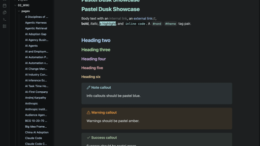

# Pastel Dusk

A dark-only [Obsidian](https://obsidian.md) theme: soft, muted **pastel turquoise**
on a deep, near-neutral dark background, with gently rounded corners. Built on top of
[insanum/obsidian_nord](https://github.com/insanum/obsidian_nord).

## How it differs from stock Nord

- **Dark only:** light mode dropped, all focus on one polished dark look.
- **Deep, near-neutral background:** a dark, low-chroma base (`#1d1f20`), with a darker left sidebar.
- **Distinct heading colours:** each level its own soft pastel (turquoise, blue, green, lilac, rose, amber).
- **Pastel turquoise accent:** soft turquoise (`#9fd6cb`) for buttons, tags, and active states.
- **Pastel blue links & files:** links and file names in soft blue (links a touch darker, files a touch lighter).
- **Soft rounded corners:** gentle radii, with panes floating as cards.
- **Folders vs files:** file names in pastel blue, folders neutral, so the tree reads clearly.
- **Soft pastel syntax & callouts:** gentle, low-saturation colours.

## Install

**Manual:**
1. Create the folder `<your vault>/.obsidian/themes/Pastel Dusk/`.
2. Copy `manifest.json` and `theme.css` into it.
3. In Obsidian: **Settings → Appearance → Themes → Pastel Dusk**.

## Credits

- Based on **"Obsidian Nord"** by Eric Davis ([insanum](https://github.com/insanum)), MIT.
- **Nord** colour palette by Arctic Ice Studio / [nordtheme.com](https://www.nordtheme.com).

Licensed under [MIT](LICENSE).
